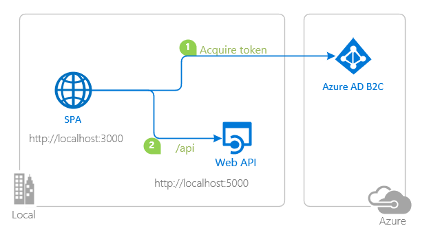

# Vanilla JavaScript Single-page Application (SPA) using MSAL.js to authorize users for calling a protected web API on Azure AD B2C

 1. [Overview](#overview)
 1. [Scenario](#scenario)
 1. [Contents](#contents)
 1. [Prerequisites](#prerequisites)
 1. [Setup](#setup)
 1. [Registration](#registration)
 1. [Running the sample](#running-the-sample)
 1. [Explore the sample](#explore-the-sample)
 1. [About the code](#about-the-code)
 1. [More information](#more-information)
 1. [Community Help and Support](#community-help-and-support)

## Overview

This sample demonstrates a Vanilla JavaScript single-page application that lets users authenticate against [Azure Active Directory B2C](https://azure.microsoft.com/services/active-directory/external-identities/b2c/) using the [Microsoft Authentication Library for JavaScript](https://github.com/AzureAD/microsoft-authentication-library-for-js) (MSAL.js), then acquires an **Access Token** for a web API that is also protected by **Azure AD B2C**. In doing so, it also illustrates various authorization and B2C concepts, such as [Access Tokens](https://docs.microsoft.com/azure/active-directory/develop/access-tokens), [Refresh Tokens](https://docs.microsoft.com/azure/active-directory-b2c/tokens-overview#token-types), [Token Lifetimes and Configuration](https://docs.microsoft.com/azure/active-directory-b2c/tokens-overview#configuration), [Dynamic Scopes and Incremental Consent](https://docs.microsoft.com/azure/active-directory/develop/v2-permissions-and-consent), **silent requests** and more.

## Scenario

1. The client application uses the **MSAL.js** to obtain an **Access Token** from **Azure AD B2C**.
1. The **Access Token** is used as a **bearer** to *authorize* the user to call a protected web API.
1. The protected web API responds with the claims in the **Access Token**.



## Contents

| File/folder           | Description                                |
|-----------------------|--------------------------------------------|
| `SPA/App/authPopup.js`    | Main authentication logic resides here (using Popup flow). |
| `SPA/App/authRedirect.js` | Use this instead of `authPopup.js` for authentication with redirect flow. |
| `SPA/App/authConfig.js`   | Contains configuration parameters for the sample. |
| `SPA/App/apiConfig.js`   | Contains Web API scopes and coordinates. |
| `SPA/App/policies.js`     | Contains B2C custom policies and user-flows.  |
| `API/process.json`   | Contains configuration parameters for logging via Bunyan.  |
| `API/index.js`   | Main application logic resides here.                     |
| `API/config.json`   | Contains authentication parameters for the sample. |

## Setup

Locate the sample folder `API`, then type:

```console
    npm install
```

Locate the sample folder `SPA`, then type:

```console
    npm install
```

## Registration

> :information_source: This sample comes with a pre-registered application for testing purposes. If you would like to use your own **Azure AD B2C** tenant and application, follow the steps below to register and configure the applications in the **Azure Portal**. Otherwise, continue with the steps for [Running the sample](#running-the-sample).

### Register the service app

1. Navigate to the [Azure portal](https://portal.azure.com) and select the **Azure AD B2C** service.
1. Select the **App Registrations** blade on the left, then select **New registration**.
1. In the **Register an application page** that appears, enter your application's registration information:
   - In the **Name** section, enter a meaningful application name that will be displayed to users of the app, for example `ms-identity-javascript-c3s2-api`.
   - Under **Supported account types**, select **Accounts in any organizational directory only**.
1. Select **Register** to create the application.
1. In the app's registration screen, find and note the **Application (client) ID**. You use this value in your app's configuration file(s) later in your code.
1. Select **Save** to save your changes.
1. In the app's registration screen, select the **Expose an API** blade to the left to open the page where you can declare the parameters to expose this app as an Api for which client applications can obtain [access tokens](https://docs.microsoft.com/azure/active-directory/develop/access-tokens) for.
The first thing that we need to do is to declare the unique [resource](https://docs.microsoft.com/azure/active-directory/develop/v2-oauth2-auth-code-flow) URI that the clients will be using to obtain access tokens for this Api. To declare an resource URI, follow the following steps:
   - Click `Set` next to the **Application ID URI** to generate a URI that is unique for this app.
   - For this sample, accept the proposed Application ID URI (api://{clientId}) by selecting **Save**.
1. All Apis have to publish a minimum of one [scope](https://docs.microsoft.com/azure/active-directory/develop/v2-oauth2-auth-code-flow#request-an-authorization-code) for the client's to obtain an access token successfully. To publish a scope, follow the following steps:
   - Select **Add a scope** button open the **Add a scope** screen and Enter the values as indicated below:
        - For **Scope name**, use `access_as_user`.
        - Select **Admins and users** options for **Who can consent?**
        - For **Admin consent display name** type `Access ms-identity-javascript-c3s2-api`
        - For **Admin consent description** type `Allows the app to access ms-identity-javascript-c3s2-api as the signed-in user.`
        - For **User consent display name** type `Access ms-identity-javascript-c3s2-api`
        - For **User consent description** type `Allow the application to access ms-identity-javascript-c3s2-api on your behalf.`
        - Keep **State** as **Enabled**
        - Click on the **Add scope** button on the bottom to save this scope.
1. On the right side menu, select the `Manifest` blade.
   - Set `accessTokenAcceptedVersion` property to **2**.
   - Click on **Save**.

#### Configure the service app to use your app registration

Open the project in your IDE (like Visual Studio or Visual Studio Code) to configure the code.

> In the steps below, "ClientID" is the same as "Application ID" or "AppId".

1. Open the `config.json` file.
1. Find the key `clientID` and replace the existing value with the application ID (clientId) of the `ms-identity-javascript-c3s2-api` application copied from the Azure portal.
1. Find the key `tenantID` and replace the existing value with your Azure AD tenant ID.
1. Find the key `audience` and replace the existing value with the application ID (clientId) of the `ms-identity-javascript-c3s2-api` application copied from the Azure portal.

#### Update the client app's registration

1. Navigate to the [Azure portal](https://portal.azure.com) and select the **Azure AD** service.
1. Select the **App Registrations** blade on the left, then find and select the application that you have registered in the previous tutorial (`ms-identity-javascript-c1s2-spa`).
1. In the **Register an application page** that appears, enter your application's registration information:
   - In the **Name** section, enter a meaningful application name that will be displayed to users of the app, for example `ms-identity-javascript-c3s2-spa`.
   - Under **Supported account types**, select **Accounts in any organizational directory or any identity provider. For authenticating users with Azure AD B2C**.
   - In the **Redirect URI (optional)** section, select **Web** in the combo-box and enter the following redirect URI: `http://localhost:6420`.
1. Select **Register** to create the application.
1. In the app's registration screen, find and note the **Application (client) ID**. You use this value in your app's configuration file(s) later in your code.
1. Select **Save** to save your changes.
1. In the app's registration screen, click on the **API Permissions** blade in the left to open the page where we add access to the APIs that your application needs.
    - Click the **Add a permission** button and then,
    - Ensure that the **My APIs** tab is selected.
    - In the list of APIs, select the API that you've just registered, i.e. `ms-identity-javascript-c3s2-api`.
    - In the **Delegated permissions** section, select the **access_as_user** in the list. Use the search box if necessary.
    - Click on the **Add permissions** button at the bottom.

#### Configure the client app to use your app registration

Open the project in your IDE (like Visual Studio or Visual Studio Code) to configure the code.

> In the steps below, "ClientID" is the same as "Application ID" or "AppId".

1. Open the `App\apiConfig.js` file.
1. Find the key `scopes` and replace the existing value with the scope of your web API (e.g. `api://e767d418-b80b-4568-9754-557f40697fc5/access_as_user`).
1. Find the key `uri` and replace the existing value with the coordinates of your web API (by default `http://localhost:5000`).

## Running the sample

Locate the sample folder `API`, then type:

```console
    npm start
```

Locate the sample folder `SPA`, then type:

```console
    npm start
```

## Explore the sample

1. Open your browser and navigate to `http://localhost:6420`.
1. Click on the **sign-in** button on the top right corner.
1. Once you authenticate, click the **Call API** button at the center.


## We'd love your feedback!

Were we successful in addressing your learning objective? Consider taking a moment to [share your experience with us](https://forms.office.com/Pages/ResponsePage.aspx?id=v4j5cvGGr0GRqy180BHbR73pcsbpbxNJuZCMKN0lURpUNDVHTkg2VVhWMTNYUTZEM05YS1hSN01EOSQlQCN0PWcu).

## About the code

### Acquire a Token

**Access Token** requests in **MSAL.js** are meant to be *per-resource-per-scope(s)*. This means that an **Access Token** requested for resource **A** with scope `scp1`:

- cannot be used for accessing resource **A** with scope `scp2`, and,
- cannot be used for accessing resource **B** of any scope.

The intended recipient of an **Access Token** is represented by the `aud` claim; in case the value for the `aud` claim does not mach the resource APP ID URI, the token should be considered invalid. Likewise, the permissions that an Access Token grants is represented by the `scp` claim. See [Access Token claims](https://docs.microsoft.com/azure/active-directory/develop/access-tokens#payload-claims) for more information.

**MSAL.js** exposes 3 APIs for acquiring a token: `acquireTokenPopup()`, `acquireTokenRedirect()` and `acquireTokenSilent()`:

```javascript
    myMSALObj.acquireTokenPopup(request)
        .then(response => {
            // do something with response
        })
        .catch(error => {
            console.log(error)
        });
```

For `acquireTokenRedirect()`, you must register a redirect promise handler:

```javascript
    myMSALObj.handleRedirectPromise()
        .then(response => {
            // do something with response
        })
        .catch(error => {
            console.log(error);
        });

    myMSALObj.acquireTokenRedirect(request);
```

### Token Validation

On the web API side, [passport-azure-ad](https://github.com/AzureAD/passport-azure-ad) validates the token against the `issuer`, `scope` and `audience` claims (defined in `BearerStrategy` constructor) using the `passport.authenticate()` API:

```javascript
    app.get('/api', passport.authenticate('oauth-bearer', { session: false }),
        (req, res) => {
            console.log('Validated claims: ', req.authInfo);
    );
```

Clients should treat access tokens as opaque strings, as the contents of the token are intended for the resource only (such as a web API or Microsoft Graph). For validation and debugging purposes, developers can decode **JWT**s (*JSON Web Tokens*) using a site like [jwt.ms](https://jwt.ms).

### CORS Settings

For the purpose of the sample, **cross-origin resource sharing** is enabled for **all** domains. This is insecure. In production, you should modify this as to allow only the domains that you designate.

```javascript
    app.use((req, res, next) => {
        res.header("Access-Control-Allow-Origin", "*");
        res.header("Access-Control-Allow-Headers", "Authorization, Origin, X-Requested-With, Content-Type, Accept");
        next();
    });
```

## Next Tutorial

Continue with the next tutorial: [Deploy your app to Azure](../../5-Deployment/README-incremental.md).

## More information

For more information about how OAuth 2.0 protocols work in this scenario and other scenarios, see [Authentication Scenarios for Azure AD](https://docs.microsoft.com/azure/active-directory/develop/authentication-flows-app-scenarios).

## Community Help and Support

Use [Stack Overflow](http://stackoverflow.com/questions/tagged/msal) to get support from the community.
Ask your questions on Stack Overflow first and browse existing issues to see if someone has asked your question before.
Make sure that your questions or comments are tagged with [`azure-ad` `azure-ad-b2c` `ms-identity` `msal`].

If you find a bug in the sample, please raise the issue on [GitHub Issues](../../issues).

To provide a recommendation, visit the following [User Voice page](https://feedback.azure.com/forums/169401-azure-active-directory).
