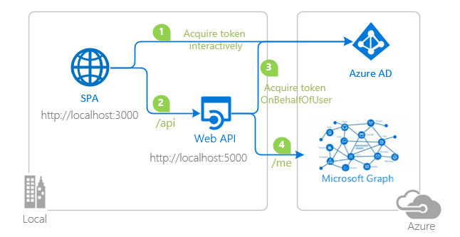

# A Node.js Web API secured by Azure AD and calling Microsoft Graph on behalf of signed-in user

 1. [Overview](#overview)
 1. [Scenario](#scenario)
 1. [Contents](#contents)
 1. [Prerequisites](#prerequisites)
 1. [Setup](#setup)
 1. [Registration](#registration)
 1. [Running the sample](#running-the-sample)
 1. [Explore the sample](#explore-the-sample)
 1. [About the code](#about-the-code)
 1. [More information](#more-information)
 1. [Community Help and Support](#community-help-and-support)

## Overview

This sample demonstrates a Vanilla JavaScript single-page application (SPA) which lets a user authenticate against [Azure Active Directory](https://docs.microsoft.com/azure/active-directory/fundamentals/active-directory-whatis) (Azure AD) using the [Microsoft Authentication Library for JavaScript](https://github.com/AzureAD/microsoft-authentication-library-for-js) (MSAL.js) and then calls a protected Node.js web API. The web API then calls the [Microsoft Graph API](https://docs.microsoft.com/graph/overview) (MS Graph) on behalf of the user signed-in to the client app using the [on-behalf-of flow](https://docs.microsoft.com/azure/active-directory/develop/v2-oauth2-on-behalf-of-flow), thus illustrating how to propagate user consent across your application topology.

## Scenario

1. The client JavaScript SPA uses **MSAL.js** to sign-in a user and obtain an [Access Token](https://docs.microsoft.com/azure/active-directory/develop/access-tokens) from **Azure AD**.
1. The **Access Token** is used as a *bearer token* to authorize the user to call a Node.js web API protected by **Azure AD**.
1. The web API exchanges the user's **Access Token** with an **Access Token** for itself to call **MS Graph**.



## Contents

| File/folder       | Description                                |
|-------------------|--------------------------------------------|
| `AppCreationScripts/` | Contains Powershell scripts to automate app registration. |
| `App/authPopup.js`    | Main authentication logic resides here (using Popup flow). |
| `App/authRedirect.js` | Use this instead of `authPopup.js` for authentication with redirect flow. |
| `App/authConfig.js`   | Contains configuration parameters for the sample. |
| `SPA/server.js`       | Simple Node server for `index.html`.        |
| `API/process.json`    | Contains configuration parameters for logging via Morgan.  |
| `API/index.js`        | Main application logic resides here.                     |
| `API/config.json`     | Contains authentication parameters for the sample. |

## Setup

Locate the sample folder `API`, then type:

```console
    npm install
```

Locate the sample folder `SPA`, then type:

```console
    npm install
```

## Registration

### Update the service app registration (ms-identity-javascript-c3s1-api)

1. Navigate to the [Azure portal](https://portal.azure.com) and select the **Azure AD** service.
1. Select the **App Registrations** blade on the left, then find and select the service app that you have registered in the previous tutorial (`ms-identity-javascript-c3s1-api`).
1. In the app's registration screen, click on the **Certificates & secrets** blade in the left to open the page where we can generate secrets and upload certificates.
1. In the **Client secrets** section, click on **New client secret**:
   - Type a key description (for instance `app secret`),
   - Select one of the available key durations (**In 1 year**, **In 2 years**, or **Never Expires**) as per your security posture.
   - The generated key value will be displayed when you click the **Add** button. Copy the generated value for use in the steps later.
   - You'll need this key later in your code's configuration files. This key value will not be displayed again, and is not retrievable by any other means, so make sure to note it from the Azure portal before navigating to any other screen or blade.
1. In the app's registration screen, click on the **API permissions** blade in the left to open the page where we add access to the APIs that your application needs.
   - Click the **Add a permission** button and then,
   - Ensure that the **Microsoft APIs** tab is selected.
   - In the *Commonly used Microsoft APIs* section, click on **Microsoft Graph**
   - In the **Delegated permissions** section, select the **offline_access**, **User.Read** in the list. Use the search box if necessary.
   - Click on the **Add permissions** button at the bottom.
1. In the app's registration screen, select the **Expose an API** blade to the left to open the page where you can declare the parameters to expose this app as an Api for which client applications can obtain [access tokens](https://docs.microsoft.com/azure/active-directory/develop/access-tokens) for.
The first thing that we need to do is to declare the unique [resource](https://docs.microsoft.com/azure/active-directory/develop/v2-oauth2-auth-code-flow) URI that the clients will be using to obtain access tokens for this Api. To declare an resource URI, follow the following steps:
   - Click `Set` next to the **Application ID URI** to generate a URI that is unique for this app.
   - For this sample, accept the proposed Application ID URI (`api://{clientId}`) by selecting **Save**.

#### Configure the service app to use your app registration

Open the project in your IDE (like Visual Studio or Visual Studio Code) to configure the code.

> In the steps below, "ClientID" is the same as "Application ID" or "AppId".

1. Open the `API\config.json` file.
1. Find the key `clientID` and replace the existing value with the application ID (clientId) of the `ms-identity-javascript-c3s1-api` application copied from the Azure portal.
1. Find the key `tenantID` and replace the existing value with your Azure AD tenant ID.
1. Find the key `clientSecret` and replace the existing value with the key you saved during the creation of the `ms-identity-javascript-c3s1-api` app in the Azure portal.

### Update the client app registration (ms-identity-javascript-c1s1-spa)

1. Navigate to the [Azure portal](https://portal.azure.com) and select the **Azure AD** service.
1. Select the **App Registrations** blade on the left, then find and select the client app that you have registered in the previous tutorial (`ms-identity-javascript-c1s1-spa`).
1. In the app's registration screen, click on the **API permissions** blade in the left to open the page where we add access to the APIs that your application needs.
    - Click the **Add a permission** button and then:
       - Ensure that the **My APIs** tab is selected.
       - In the list of APIs, select the API `ms-identity-javascript-c3s1-api`.
       - In the **Delegated permissions** section, select the **access_as_user** in the list. Use the search box if necessary.
       - Click on the **Add permissions** button at the bottom.

#### Configure the client app to use your app registration

Open the project in your IDE (like Visual Studio or Visual Studio Code) to configure the code.

> In the steps below, "ClientID" is the same as "Application ID" or "AppId".

Open the `App\authConfig.js` file. Then:

1. Find the key `Enter_the_Application_Id_Here` and replace the existing value with the application ID (clientId) of the `ms-identity-javascript-c1s1` application copied from the Azure portal.
1. Find the key `Enter_the_Tenant_Info_Here` and replace the existing value with your tenant ID copied from the Azure portal.
1. Find the key `Enter_the_Redirect_Uri_Here` and replace the existing value with the base address of the ms-identity-javascript-signin project (by default `http://localhost:3000`).
1. Find the key `Enter_the_Web_Api_Uri_Here` and replace the existing value with the URL of the exposed web api endpoint, e.g. `http://localhost:5000/api`
1. Find the key `Enter_the_Web_Api_Scope_Here` and replace the existing value with the application ID (clientId) of the, e.g. `api://cd96451f-9709-4a95-b1f5-79da05cf8502/.default`

#### Configure knownClientApplications for the service app

For a middle tier web API to be able to call a downstream web API, the middle tier app needs to be granted the required permissions as well. However, since the middle tier cannot interact with the signed-in user, it needs to be explicitly bound to the client app in its **Azure AD** registration. This binding merges the permissions required by both the client and the middle tier web API and presents it to the end user in a single consent dialog. The user then consent to this combined set of permissions.

To achieve this, you need to add the **Application Id** of the client app, in the Manifest of the web API in the `knownClientApplications` property. Here's how:

1. In the [Azure portal](https://portal.azure.com), navigate to your `ms-identity-javascript-c3s1-api` app registration, and select **Manifest** section.
1. In the manifest editor, change the `"knownClientApplications": []` line so that the array contains the Client ID of the client application (`ms-identity-javascript-c1s1-spa`) as an element of the array.

    For instance:

    ```json
        "knownClientApplications": ["ca8dca8d-f828-4f08-82f5-325e1a1c6428"],
    ```

1. **Save** the changes to the manifest.

## Running the sample

Locate the sample folder `API`, then type:

```console
    npm start
```

Locate the sample folder `SPA`, then type:

```console
    npm start
```

## Explore the sample

1. Open your browser and navigate to `http://localhost:3000`.
1. Click the **sign-in** button on the top right corner.
1. Once you authenticate, click the **Call API** button at the center.


## We'd love your feedback!

Were we successful in addressing your learning objective? Consider taking a moment to [share your experience with us](https://forms.office.com/Pages/ResponsePage.aspx?id=v4j5cvGGr0GRqy180BHbR73pcsbpbxNJuZCMKN0lURpUNDVHTkg2VVhWMTNYUTZEM05YS1hSN01EOSQlQCN0PWcu).

## About the code

### /.default scope and combined consent

Notice that we have set the scope in the **client** app as `api://cd96451f-9709-4a95-b1f5-79da05cf8502/.default`, instead of `api://cd96451f-9709-4a95-b1f5-79da05cf8502/access_as_user`. The [/.default](https://docs.microsoft.com/azure/active-directory/develop/v2-permissions-and-consent#the-default-scope) scope is a built-in scope for every application that refers to the static list of permissions configured on the application registration in **Azure Portal**. Basically, it bundles all the permissions from the web API and MS Graph in one call, thus allowing you to grant combined consent to both the **client** app and the **web API**.

Furthermore, we had configured the `knownClientApplications` attribute in **application manifest**. This attribute is used for bundling consent if you have a solution that contains two (or more) parts: a **client** app and a custom **web API**. If you enter the appID (clientID) of the client app into this array, the user will only have to consent once to the client app. **Azure AD** will know that consenting to the client means implicitly consenting to the web API.

### Token validation

The middle-tier web API uses the [passport-azure-ad](https://github.com/AzureAD/passport-azure-ad) to validate the token against the `issuer`, `scope` and `audience` claims (defined in `BearerStrategy` constructor) using the `passport.authenticate()` API:

```javascript
    app.get('/api', passport.authenticate('oauth-bearer', { session: false }),
        (req, res) => {
            console.log('Validated claims: ', req.authInfo);
    );
```

Clients, on the other hand, should treat access tokens as opaque strings, as the contents of the token are intended for the resource only (such as a web API or Microsoft Graph). For validation and debugging purposes, developers can decode **JWT**s (*JSON Web Tokens*) using a site like [jwt.ms](https://jwt.ms).

## Next Tutorial

Either continue with the next tutorial [Call a protected web API that calls another web API using conditional access](../../4-AdvancedGrants/2-call-api-api-ca/README-incremental.md) or skip to learn how to [Deploy your apps to Azure](../../5-Deployment/README-incremental.md).

## More information

For more information about how OAuth 2.0 protocols work in this scenario and other scenarios, see [Authentication Scenarios for Azure AD](https://docs.microsoft.com/azure/active-directory/develop/authentication-flows-app-scenarios).

## Community Help and Support

Use [Stack Overflow](http://stackoverflow.com/questions/tagged/msal) to get support from the community.
Ask your questions on Stack Overflow first and browse existing issues to see if someone has asked your question before.
Make sure that your questions or comments are tagged with [`ms-identity` `azure-ad` `azure-ad-b2c` `msal`].

If you find a bug in the sample, please raise the issue on [GitHub Issues](../../issues).

To provide a recommendation, visit the following [User Voice page](https://feedback.azure.com/forums/169401-azure-active-directory).