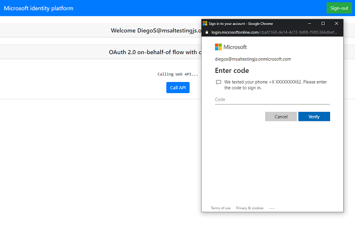

# Handling Conditional Access challenges in an Azure AD protected Node.js web API calling another protected Node.js web API on behalf of a user

 1. [Overview](#overview)
 1. [Scenario](#scenario)
 1. [Contents](#contents)
 1. [Prerequisites](#prerequisites)
 1. [Setup](#setup)
 1. [Registration](#registration)
 1. [Running the sample](#running-the-sample)
 1. [Explore the sample](#explore-the-sample)
 1. [About the code](#about-the-code)
 1. [More information](#more-information)
 1. [Community Help and Support](#community-help-and-support)
 1. [Contributing](#contributing)

## Overview

This sample demonstrates how a JavaScript single-page application (SPA) calling a middle-tier Node.js web API which in turn calls another Node.js web API downstream, using an [Access Token](https://aka.ms/access-tokens) obtained via [OAuth 2.0 on-behalf-of flow](https://docs.microsoft.com/azure/active-directory/develop/v2-oauth2-on-behalf-of-flow) handles [claims challenge](https://docs.microsoft.com/azure/active-directory/develop/msal-error-handling-js#conditional-access-and-claims-challenges) generated by downstream APIs. The downstream web API has a [conditional access](https://docs.microsoft.com/azure/active-directory/conditional-access/overview) policy that enables [multi-factor authentication](https://docs.microsoft.com/azure/active-directory/authentication/tutorial-enable-azure-mfa) (MFA). Thus, the [Access Token](https://aka.ms/access-tokens) for the downstream web API will only be issued by Azure AD if the signed-in user has performed **MFA**. However, since the downstream web API has no user interaction capability, the [claims challenge](https://docs.microsoft.com/azure/active-directory/develop/msal-error-handling-js#conditional-access-and-claims-challenges) generated by the conditional access policy needs to be *propagated back* to the client app (SPA) via the middle-tier web API, which then can take the user back to Azure AD to get the **MFA** done.

## Scenario

1. The client app uses the **MSAL.js** to sign-in a user and obtain a **JWT** [Access Token](https://aka.ms/access-tokens) from **Azure AD** for the middle-tier web API.
1. The access token is used as a *bearer token* to authorize the user to call the **middle-tier web API** protected by the **Microsoft identity platform**.
1. The **middle-tier web API** uses the access token sent from the client app to **Azure AD** to receive a new access token using the [on-behalf-of flow](https://docs.microsoft.com/azure/active-directory/develop/v2-oauth2-on-behalf-of-flow) for the downstream web API.
1. The **middle-tier web API** uses this new access token to call the **downstream web API**.
1. The **Downstream web API** generates a **claims challenge** if the user hasn't satisfied the MFA and sends the challenge back to the **middle-tier web API**.
1. The **middle-tier web API** propagates the **claims challenge** back to client app, which then initiates an **interactive** token request again with the Microsoft identity platform to get the user to perform MFA as well.
1. Once the user successfully conducts MFA, a new access token for is provided to client app for the **middle-tier web API**.
1. Steps **3** and **4** are repeated, and this time the call to **downstream web API** succeeds.


## Contents

| File/folder       | Description                                |
|-------------------|--------------------------------------------|
| `AppCreationScripts/` | Contains Powershell scripts to automate app registration. |
| `SPA/App/authPopup.js`    | Main authentication logic resides here (using popup flow). |
| `SPA/App/authRedirect.js` | Use this instead of `authPopup.js` for authentication with redirect flow. |
| `SPA/App/authConfig.js`   | Contains configuration parameters for the SPA.   |
| `SPA/App/apiConfig.js`   | Contains configuration parameters for the SPA.    |
| `MiddletierAPI/config.json`| Contains authentication parameters for the middle-tier API. |
| `DownstreamAPI/config.json`| Contains authentication parameters for the downstream API. |

## Prerequisites

- Make sure that the user account you want to use for this is [enabled for MFA]((https://docs.microsoft.com/azure/active-directory/user-help/user-help-auth-app-add-work-school-account)).

## Setup

Locate the project root folder (`4-AdvancedGrants\2-call-api-api-ca`) in a command prompt. Then:

```console
    cd DownstreamAPI
    npm install
```

```console
    cd ..
    cd MiddletierAPI
    npm install
```

```console
    cd ..
    cd SPA
    npm install
```

## Registration

### Register the downstream service app (ms-identity-javascript-c4s2-downstream)

1. Navigate to the [Azure portal](https://portal.azure.com) and select the **Azure AD** service.
1. Select the **App Registrations** blade on the left, then select **New registration**.
1. In the **Register an application page** that appears, enter your application's registration information:
   - In the **Name** section, enter a meaningful application name that will be displayed to users of the app, for example `ms-identity-javascript-c4s2-downstream`.
   - Under **Supported account types**, select **Accounts in this organizational directory only**.
1. Select **Register** to create the application.
1. In the app's registration screen, find and note the **Application (client) ID**. You use this value in your app's configuration file(s) later in your code.
1. Select **Save** to save your changes.
1. In the app's registration screen, select the **Expose an API** blade to the left to open the page where you can declare the parameters to expose this app as an API for which client applications can obtain [access tokens](https://docs.microsoft.com/azure/active-directory/develop/access-tokens) for.
The first thing that we need to do is to declare the unique [resource](https://docs.microsoft.com/azure/active-directory/develop/v2-oauth2-auth-code-flow) URI that the clients will be using to obtain access tokens for this API. To declare an resource URI, follow the following steps:
   - Select `Set` next to the **Application ID URI** to generate a URI that is unique for this app.
   - For this sample, accept the proposed Application ID URI (`api://{clientId}`) by selecting **Save**.
1. All APIs have to publish a minimum of one [scope](https://docs.microsoft.com/azure/active-directory/develop/v2-oauth2-auth-code-flow#request-an-authorization-code) for the client's to obtain an access token successfully. To publish a scope, follow the following steps:
   - Select **Add a scope** button open the **Add a scope** screen and Enter the values as indicated below:
        - For **Scope name**, use `access_downstream_api_as_user`.
        - Select **Admins and users** options for **Who can consent?**.
        - For **Admin consent display name** type `Access ms-identity-javascript-c4s2-downstream`.
        - For **Admin consent description** type `Allows the app to access ms-identity-javascript-c4s2-downstream as the signed-in user.`
        - For **User consent display name** type `Access ms-identity-javascript-c4s2-downstream`.
        - For **User consent description** type `Allow the application to access ms-identity-javascript-c4s2-downstream on your behalf.`
        - Keep **State** as **Enabled**.
        - Select the **Add scope** button on the bottom to save this scope.
1. On the right side menu, select the `Manifest` blade.
   - Set `accessTokenAcceptedVersion` property to **2**.
   - Click on **Save**.

#### Configure the downstream service app (ms-identity-javascript-c4s2-downstream) to use your app registration

Open the project in your IDE (like Visual Studio or Visual Studio Code) to configure the code.

> In the steps below, "ClientID" is the same as "Application ID" or "AppId".

1. Open the `DownstreamAPI\config.json` file.
1. Find the key `clientID` and replace the existing value with the application ID (clientId) of `ms-identity-javascript-c4s2-downstream` app copied from the Azure portal.
1. Find the key `tenantID` and replace the existing value with your Azure AD tenant ID.

### Update the middle-tier service app registration (ms-identity-javascript-c3s1-api)

1. Navigate to the [Azure portal](https://portal.azure.com) and select the **Azure AD** service.
1. Select the **App Registrations** blade on the left, then find and select the service app that you have registered in the previous tutorial (`ms-identity-javascript-c3s1-api`).
1. In the app's registration screen, select the **API permissions** blade in the left to open the page where we add access to the APIs that your application needs.
   - Select the **Add a permission** button and then,
   - Ensure that the **My APIs** tab is selected.
   - In the list of APIs, select the API `ms-identity-javascript-c4s2-downstream`.
   - In the **Delegated permissions** section, select the **access_downstream_api_as_user** in the list. Use the search box if necessary.
   - Select the **Add permissions** button at the bottom.

#### Configure the middle-tier service app (ms-identity-javascript-c3s1-api) to use your app registration

Open the project in your IDE (like Visual Studio or Visual Studio Code) to configure the code.

> In the steps below, "ClientID" is the same as "Application ID" or "AppId".

1. Open the `MiddletierAPI\config.json` file.
1. Find the key `clientID` and replace the existing value with the application ID (clientId) of `ms-identity-javascript-c3s1-api` app copied from the Azure portal.
1. Find the key `tenantID` and replace the existing value with your Azure AD tenant ID.
1. Find the key `clientSecret` and replace the existing value with the key you saved during the creation of `ms-identity-javascript-c3s1-api` copied from the Azure portal.
1. Find the key `downstreamAPI.resourceScopes` and replace the existing value with the scope you have exposed during the registration of DownstreamAPI project e.g. `api://<DownstreamAPI_Application_Id>/access_downstream_api_as_user`.

### Update the SPA app registration (ms-identity-javascript-c1s1-spa)

1. No additional steps required.

#### Configure the SPA app (ms-identity-javascript-c1s1-spa) to use your app registration

Open the project in your IDE (like Visual Studio or Visual Studio Code) to configure the code.

> In the steps below, "ClientID" is the same as "Application ID" or "AppId".

1. Open the `SPA\App\authConfig.js` file.
1. Find the key `Enter_the_Application_Id_Here` and replace the existing value with the application ID (clientId) of `ms-identity-javascript-c1s1-spa` app copied from the Azure portal.
1. Find the key `https://login.microsoftonline.com/Enter_the_Tenant_Info_Here` and replace the existing value with your tenant ID copied from Azure portal.
1. Find the key `Enter_the_Redirect_Uri_Here` and replace the existing value with the Redirect URI for `ms-identity-javascript-c1s1-spa`. (by default `http://localhost:3000/`).

1. Open the `SPA\App\apiConfig.js` file.
1. Find the key `Enter_the_Web_Api_Scope_Here` and replace the existing value with the scope for `ms-identity-javascript-c3s1-api` using the `.default` form e.g. `api://<Enter_Web_API_Application_Id>/.default`.

### Enable Conditional Access for the downstream web API

1. Inside the **Azure Active Directory** window, select the **Conditional Access** button near the bottom of the list under **Security**.


2. Select **New Policy** and name your policy.


3. Select the **Users and groups** button and then select the **user account** you want to work with in the **Include** tab (*hint*: you might want to use a test account for this).


4. Select the **Cloud apps and actions**, then hit the **Select apps** radio button in the **Include** tab, and select the `ms-identity-javascript-c4s2-downstream`.


5. Finally, select the **Grant** button and hit **Grant access**. Then check the **Require multi-factor authentication** option.


6. Enable the policy and save. Access to your web API now requires **multi-factor authentication**!

## Running the sample

Run all three projects. Open **3** separate command prompts, and type:

```console
    cd DownstreamAPI
    npm start
```

```console
    cd MiddletierAPI
    npm start
```

```console
    cd SPA
    npm start
```

## Explore the sample

1. Open your browser and navigate to `http://localhost:3000`.
1. Click the **sign-in** button on the top right corner.
1. Once you authenticate, click the **Call API** button at the center, which will result in **MFA required** screen.



4. If the user has no predefined verification method to satisfy **MFA**, they will see the following screen:


5. They will then have to setup a verification method:


> :information_source: Did the sample not work for you as expected? Then please reach out to us using the [GitHub Issues](../../../issues) page.

## We'd love your feedback!

Were we successful in addressing your learning objective? Consider taking a moment to [share your experience with us](https://forms.office.com/Pages/ResponsePage.aspx?id=v4j5cvGGr0GRqy180BHbR73pcsbpbxNJuZCMKN0lURpUNDVHTkg2VVhWMTNYUTZEM05YS1hSN01EOSQlQCN0PWcu).

## About the code

### Handling conditional access claims challenge

If the conditional access policy is not satisfied when calling the downstream web API, Azure AD will throw an error together with a claims challenge. In our middle-tier web API, we are to catch this error coming from the downstream web API, and send it to the client SPA. This is illustrated in the middle-tier web API [index.js](./MiddletierAPI/index.js) file:

```javascript
   try {
      // request new token and use it to call resource API on user's behalf
      let tokenObj = await getNewAccessToken(userToken);

      if (tokenObj['error_codes']) {
            
            /**
             * Conditional access MFA requirement generates AADSTS50076 error.
             * If this occurs, sample middle-tier API will propagate this to client
             * For more, visit: https://docs.microsoft.com/azure/active-directory/develop/v2-conditional-access-dev-guide
             */

            if (tokenObj['error_codes'].includes(50076) || tokenObj['error_codes'].includes(50079)) {
               return res.status(401).json(tokenObj);
            }
      }

      // access the resource with the token
      let apiResponse = await callResourceAPI(tokenObj['access_token'], config.resources.downstreamAPI.resourceUri)
      res.status(200).json(apiResponse);
   } catch (error) {
      console.log(error)
      return res.status(500).json(error);
   }
```

Then, in the SPA project, we catch this error response and initiate an interactive token request with additional claims. To do so, we append the JSON object from the response to our [tokenRequest](./SPA/App/authConfig.js) object before triggering the interactive token request. This is illustrated in [api.js](./SPA/App/api.js):

```javascript
   // check for any errors
   if (response['error_codes']) {

      /**
       * Conditional access MFA requirement generates AADSTS50076 error.
       * If this occurs, sample middle-tier API will propagate this to client
       * For more, visit: https://docs.microsoft.com/azure/active-directory/develop/v2-conditional-access-dev-guide
       */
      if (response['error_codes'].includes(50076) || response['error_codes'].includes(50079)) {

          // attach the stringified JSON claims challenge to token request 
          tokenRequest.claims = response['claims'];
    
          // calls the MSAL.js acquireToken* API
          passTokenToApi();
      }
   } else {
      // if no errors, display user name
      logMessage('Web API responded: Hello ' + response['name'] + '!');
   }
```

## Next Tutorial

Continue with the next tutorial: [Deploy your apps to Azure](../../5-Deployment/README-incremental.md).

## More information

For more information about how OAuth 2.0 protocols work in this scenario and other scenarios, see [Authentication Scenarios for Azure AD](https://docs.microsoft.com/azure/active-directory/develop/authentication-flows-app-scenarios).

## Community Help and Support

Use [Stack Overflow](http://stackoverflow.com/questions/tagged/msal) to get support from the community.
Ask your questions on Stack Overflow first and browse existing issues to see if someone has asked your question before.
Make sure that your questions or comments are tagged with [`azure-active-directory` `azure-ad-b2c` `ms-identity` `adal` `msal`].

If you find a bug in the sample, raise the issue on [GitHub Issues](../../../issues).

To provide feedback on or suggest features for Azure Active Directory, visit [User Voice page](https://feedback.azure.com/forums/169401-azure-active-directory).

## Contributing

If you'd like to contribute to this sample, see [CONTRIBUTING.MD](/CONTRIBUTING.md).

This project has adopted the [Microsoft Open Source Code of Conduct](https://opensource.microsoft.com/codeofconduct/). For more information, see the [Code of Conduct FAQ](https://opensource.microsoft.com/codeofconduct/faq/) or contact [opencode@microsoft.com](mailto:opencode@microsoft.com) with any additional questions or comments.
