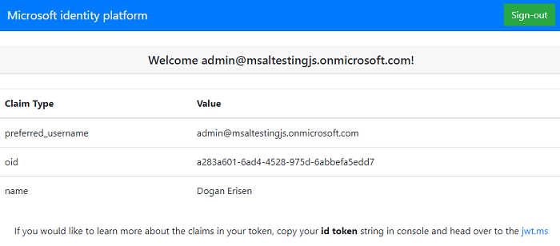
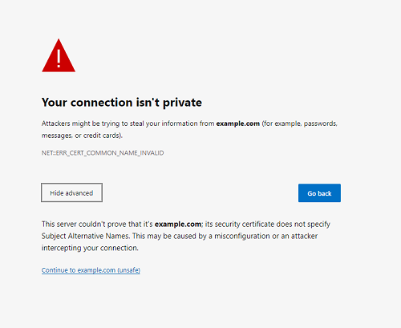

# Azure AD ReplyURL restrictions and handling authentication flow in sub-domains

 1. [Overview](#overview)
 1. [Scenario](#scenario)
 1. [Contents](#contents)
 1. [Prerequisites](#prerequisites)
 1. [Setup](#setup)
 1. [Registration](#registration)
 1. [Running the sample](#running-the-sample)
 1. [Explore the sample](#explore-the-sample)
 1. [About the code](#about-the-code)
 1. [More information](#more-information)
 1. [Community Help and Support](#community-help-and-support)
 1. [Contributing](#contributing)

## Overview

This sample demonstrates a Vanilla JavaScript single-page application (SPA) that authenticates users against Azure Active Directory (Azure AD) using the [Microsoft Authentication Library for JavaScript](https://github.com/AzureAD/microsoft-authentication-library-for-js) (MSAL.js).

In some **CD/CI** scenarios, you may have to support authentication in client applications running on sub-domains. For instance, you might have a system where live previews of your feature branches are generated and run on a special sub-domain such as "<feature_name>.yourdomain.com".

Since **MSAL.js** caches tokens with respect to the domain where the request originates, cache entries are **not** shared between "yourdomain.com" and "<feature_name>.yourdomain.com". This means that, when you initiate a login request from "<feature_name>.yourdomain.com" and Azure AD redirects back to "yourdomain.com", authentication will fail with the error: "Unable to get valid login request url from cache, redirecting to home page".

As registering a new replyURL for each sub-domain can get impractical quickly, you might be tempted to register a **wild-card** replyURL like "*.yourdomain.com". However, **wild-card** urls should be avoided due to security implications. According to the OAuth 2.0 specification ([section 3.1.2 of RFC 6749](https://tools.ietf.org/html/rfc6749#section-3.1.2)), a redirection endpoint URI must be an absolute URI. The alternative is to use the [state parameter approach](https://docs.microsoft.com/azure/active-directory/develop/reply-url#use-a-state-parameter). Here, this approach is illustrated.

## Scenario

1. Call `loginRedirect()` on sub-domain with subdomain url in `state` parameter.
1. Redirect to **Azure** AD sign-in page.
1. Redirect back to parent-domain with token/code response in hash.
1. Detect that url has a response hash, strip the hash from the url, parse out the `state` parameter and retrieve the url from step **1**.
1. Redirect to the url retrieved from step **4** and append the full hash onto that url.
1. Call `handleRedirectCallback()` on your sub-domain to process the response and cache the tokens.


## Contents

| File/folder                | Description                                       |
|----------------------------|---------------------------------------------------|
| `AppCreationScripts/`      | Contains Powershell scripts for app registration. |
| `ReadmeFiles/`             | Contains diagrams and screenshots.                |
| `SPA1/App/AuthConfig.js`   | Authentication parameters for SPA1.               |
| `SPA1/App/AuthRedirect.js` | Main authentication logic for SPA1 resides here.  |
| `SPA2/App/AuthConfig.js`   | Authentication parameters for SPA2.               |
| `SPA2/App/AuthRedirect.js` | Main authentication logic for SPA2 resides here.  |

## Prerequisites

- [Node.js](https://nodejs.org/en/download/) must be installed to run this sample.
- [Visual Studio Code](https://code.visualstudio.com/download) is recommended for running and editing this sample.
- [OpenSSL](https://github.com/openssl/openssl) for generating self-signed SSL certificates.
- A modern web browser. This sample uses **ES6** conventions and will not run on **Internet Explorer**.
- An **Azure AD** tenant. For more information see: [How to get an Azure AD tenant](https://docs.microsoft.com/azure/active-directory/develop/quickstart-create-new-tenant)
- A user account in your **Azure AD** tenant.

## Setup

In a terminal, locate the sample root folder. Then:

```console
    cd DomainTestSPA
    cd SPA1
    npm install
    cd ..
    cd SPA2
    npm install
```

### Registration

There is one project in this sample. To register it, you can:

- follow the steps below for manually register your apps
- or use PowerShell scripts that:
  - **automatically** creates the Azure AD applications and related objects (passwords, permissions, dependencies) for you.
  - modify the projects' configuration files.

<details>
  <summary>Expand this section if you want to use this automation:</summary>

> :warning: If you have never used **Azure AD Powershell** before, we recommend you go through the [App Creation Scripts](./AppCreationScripts/AppCreationScripts.md) once to ensure that your environment is prepared correctly for this step.

1. On Windows, run PowerShell as **Administrator** and navigate to the root of the cloned directory
1. If you have never used Azure AD Powershell before, we recommend you go through the [App Creation Scripts](./AppCreationScripts/AppCreationScripts.md) once to ensure that your environment is prepared correctly for this step.
1. In PowerShell run:

   ```PowerShell
   Set-ExecutionPolicy -ExecutionPolicy RemoteSigned -Scope Process -Force
   ```

1. Run the script to create your Azure AD application and configure the code of the sample application accordingly.
1. In PowerShell run:

   ```PowerShell
   cd .\AppCreationScripts\
   .\Configure.ps1
   ```

   > Other ways of running the scripts are described in [App Creation Scripts](./AppCreationScripts/AppCreationScripts.md)
   > The scripts also provide a guide to automated application registration, configuration and removal which can help in your CI/CD scenarios.

</details>

### Choose the Azure AD tenant where you want to create your applications

As a first step you'll need to:

1. Sign in to the [Azure portal](https://portal.azure.com).
1. If your account is present in more than one Azure AD tenant, select your profile at the top right corner in the menu on top of the page, and then **switch directory** to change your portal session to the desired Azure AD tenant.

### Register the app

1. Navigate to the [Azure portal](https://portal.azure.com) and select the **Azure AD** service.
1. Select the **App Registrations** blade on the left, then select **New registration**.
1. In the **Register an application page** that appears, enter your application's registration information:
   - In the **Name** section, enter a meaningful application name that will be displayed to users of the app, for example `DomainTestSPA`.
   - Under **Supported account types**, select **Accounts in this organizational directory only**.
   - In the **Redirect URI (optional)** section, select **Single-page application** in the combo-box and enter the following redirect URI: `https://example.com:3000`.
1. Select **Register** to create the application.
1. In the app's registration screen, find and note the **Application (client) ID**. You use this value in your app's configuration file(s) later in your code.
1. Select **Save** to save your changes.

#### Configure the code to use your app registration

Open the project in your IDE (like Visual Studio or Visual Studio Code) to configure the code.

> In the steps below, "ClientID" is the same as "Application ID" or "AppId".

1. Open the `SPA1\App\authConfig.js` file.
1. Find the key `Enter_the_Application_Id_Here` and replace the existing value with the application ID (clientId) of `DomainTestSPA` app copied from the Azure portal.
1. Find the key `Enter_the_Tenant_Info_Here` and replace the existing value with your Azure AD tenant ID.
1. Find the key `Enter_the_Redirect_Uri_Here` and replace the existing value with the Redirect URI for `DomainTestSPA`. (by default `https://example.com:3000`).

Perform the same steps for **SPA2**:

1. Open the `SPA2\App\authConfig.js` file.
1. Find the key `Enter_the_Application_Id_Here` and replace the existing value with the application ID (clientId) of `DomainTestSPA` app copied from the Azure portal.
1. Find the key `Enter_the_Tenant_Info_Here` and replace the existing value with your Azure AD tenant ID.
1. Find the key `Enter_the_Redirect_Uri_Here` and replace the existing value with the Redirect URI for `DomainTestSPA`. (by default `https://example.com:3000`).

### Simulating sub-domains on localhost

1. Locate the `hosts` file:
    - On **Windows**, locate the `hosts` file at `Windows\System32\drivers\etc\hosts`.
    - On **MacOS**, locate the `hosts` file at `private/etc/hosts`.
2. Open the `hosts` file in a text editor and add the following lines to the end of the it:

    ```txt
        # Simulate subdomains
        127.0.0.1 example.com
        127.0.0.1 subdomain1.example.com
    ```

> :information_source: clarifications, remarks etc.

### Generating and trusting a self-signed SSL certificate

Install **OpenSSL** for your **OS** following the guide at [github.com/openssl](https://github.com/openssl/openssl#build-and-install). Afterwards, add the path to `OpenSSL` to your **environment variables** so that you can call it from anywhere.

Type the following in a terminal:

```console
    OpenSSL> req -new -sha256 -nodes -out example.com.csr -newkey rsa:2048 -keyout example.com.key 
```

You will be prompted to enter some identifying information, and a **challenge password**, which will be asked in the next step. After that, the following files should be generated: `example.com.csr`, `example.com.key`.

```console
    OpenSSL> x509 -req -in example.com.csr -CA rootSSL.pem -CAkey rootSSL.key -CAcreateserial -out example.com.crt -days 500 -sha256
```

This should generate the signed `example.com.crt` file. In the next step, we will *trust* this certificate:

- For Windows users, follow the guide here: [Installing the trusted root certificate](https://docs.microsoft.com/skype-sdk/sdn/articles/installing-the-trusted-root-certificate).
- For MacOS users, follow the guide here: [ENTER_NAME_HERE](ENTER_LINK_HERE).

> :warning: You might need **administrator** privileges for running the commands above.

## Running the sample

In a terminal, locate the sample root folder. Then:

```console
    cd SPA1
    npm start
```

In a **separate** terminal, locate the sample root folder. Then:

```console
    cd SPA2
    npm start
```

## Explore the sample

1. Open your browser and navigate to `https://subdomain1.example.com:3001`.
1. Click on the **sign-in** button on the top right corner.
    - After entering your credentials, you will be redirected to `https://example.com:3000` and the **SPA1** will process the hash.
    - After that, **SPA1** will redirect you back to `https://subdomain1.example.com:3001` and authentication for **SPA2** will succeed.



> :warning: Your browser may show warning screen similar to the one below. Since we are on localhost, you may ignore this warning and continue safely.



> :information_source: Did the sample not work for you as expected? Then please reach out to us using the [GitHub Issues](../../../issues) page.

## We'd love your feedback!

Were we successful in addressing your learning objective? Consider taking a moment to [share your experience with us](https://forms.office.com/Pages/ResponsePage.aspx?id=v4j5cvGGr0GRqy180BHbR73pcsbpbxNJuZCMKN0lURpUNDVHTkg2VVhWMTNYUTZEM05YS1hSN01EOSQlQCN0PWcu).

## About the code

### Creating an HTTPS server in Node.js

In both **SPA1** and **SPA2**, we first setup a **HTTPS** server by importing the generated **certificate** and **public key** files and passing them as `options` to `https.createServer()` method. This is shown below (in [server.js](./SPA1/server.js)):

```javascript
    const express = require('express');
    const https = require("https");
    const fs = require("fs");

    const DEFAULT_PORT = process.env.PORT || 3001;
    
    // initialize express.
    const app = express();
    
    const options = {
        key: fs.readFileSync(path.join(__dirname + "/example.com.key")),
        cert: fs.readFileSync(path.join(__dirname + "/example.com.crt"))
    };
    
    const server = https.createServer(options, app);
    
    server.listen(port, () => {
        console.log("server started on port : " + DEFAULT_PORT)
    });
```

### Using state, parsing hash and redirecting

In sub-domain client **SPA2**, we create a `state` parameter and add it to `loginRequest` object as shown below. We then pass this object to **MSAL.j** `loginRedirect()` API.

```javascript
    // generate a unique string as nonce parameter against csrf attacks
    window.sessionStorage.setItem('nonce', myMSALObj.browserCrypto.guidGenerator.generateGuid());

    // encode the state object
    loginRequest.state = myMSALObj.browserCrypto.base64Encode(
        JSON.stringify({
            origin: window.location.origin, 
            nonce: window.sessionStorage.getItem('nonce')
        })            
    );

    myMSALObj.loginRedirect(loginRequest);
```

Then, in parent-domain client **SPA1**, detect state in hash and retrieve redirect URL.

```javascript
    if (window.location.hash.length !== 0 && window.location.hash.includes('state')) {
        
        console.log('State in hash detected');
    
        const state = window.location.hash.split("state")[1];
        let origin = "";
    
        try {
            const urlInState = decodeURIComponent(state.split('&session_')[0]);
            const decoded = myMSALObj.browserCrypto.base64Decode(urlInState);
            origin = decoded.split('"origin":"')[1].split('"')[0];
        } catch (e) { 
            // malformed URI sequence
            console.error(e);
        }
    
        // make sure the response is not for this origin
        if (origin !== window.location.origin) {
            window.location.replace(origin + '/' + window.location.hash);
        }
    }
```

Finally, in the sub-domain client **SPA2**, process the response hash and check if `nonce` parameter generated before sending the authentication request matches the one retrieved in state.

```javascript
myMSALObj.handleRedirectPromise()
    .then((response) => {
        if (response !== null) {
        let originInState = "";
        let nonceInState = "";
    
        try {
            const urlInState = decodeURIComponent(response.state.split('&session_')[0]);
            const decodedUrlInState = myMSALObj.browserCrypto.base64Decode(urlInState);
            originInState = decodedUrlInState.split('"origin":"')[1].split('"')[0];
            nonceInState = decodedUrlInState.split('"nonce":"')[1].split('"')[0];

                if (isGuid(nonceInState) && window.sessionStorage.getItem('nonce') === nonceInState) {
                    username = response.account.username;
                    welcomeUser(username);
                    updateTable();
                } 
            
            } catch (e) { 
                // malformed URI sequence
                console.error(e);
            }
        } else {
            selectAccount();
        }
    })
    .catch((error) => {
        console.error(error);
    });
```

## More information

- [Microsoft identity platform (Azure Active Directory for developers)](https://docs.microsoft.com/azure/active-directory/develop/)
- [Overview of Microsoft Authentication Library (MSAL)](https://docs.microsoft.com/azure/active-directory/develop/msal-overview)
- [Quickstart: Register an application with the Microsoft identity platform (Preview)](https://docs.microsoft.com/azure/active-directory/develop/quickstart-register-app)
- [Quickstart: Configure a client application to access web APIs (Preview)](https://docs.microsoft.com/azure/active-directory/develop/quickstart-configure-app-access-web-apis)
- [Understanding Azure AD application consent experiences](https://docs.microsoft.com/azure/active-directory/develop/application-consent-experience)
- [Understand user and admin consent](https://docs.microsoft.com/azure/active-directory/develop/howto-convert-app-to-be-multi-tenant#understand-user-and-admin-consent)
- [Application and service principal objects in Azure Active Directory](https://docs.microsoft.com/azure/active-directory/develop/app-objects-and-service-principals)
- [National Clouds](https://docs.microsoft.com/azure/active-directory/develop/authentication-national-cloud#app-registration-endpoints)
- [MSAL code samples](https://docs.microsoft.com/azure/active-directory/develop/sample-v2-code)
- [Initialize client applications using MSAL.js](https://docs.microsoft.com/azure/active-directory/develop/msal-js-initializing-client-applications)
- [Single sign-on with MSAL.js](https://docs.microsoft.com/azure/active-directory/develop/msal-js-sso)
- [Handle MSAL.js exceptions and errors](https://docs.microsoft.com/azure/active-directory/develop/msal-handling-exceptions?tabs=javascript)
- [Logging in MSAL.js applications](https://docs.microsoft.com/azure/active-directory/develop/msal-logging?tabs=javascript)
- [Pass custom state in authentication requests using MSAL.js](https://docs.microsoft.com/azure/active-directory/develop/msal-js-pass-custom-state-authentication-request)
- [Prompt behavior in MSAL.js interactive requests](https://docs.microsoft.com/azure/active-directory/develop/msal-js-prompt-behavior)
- [Use MSAL.js to work with Azure AD B2C](https://docs.microsoft.com/azure/active-directory/develop/msal-b2c-overview)

For more information about how OAuth 2.0 protocols work in this scenario and other scenarios, see [Authentication Scenarios for Azure AD](https://docs.microsoft.com/azure/active-directory/develop/authentication-flows-app-scenarios).

## Community Help and Support

Use [Stack Overflow](http://stackoverflow.com/questions/tagged/msal) to get support from the community.
Ask your questions on Stack Overflow first and browse existing issues to see if someone has asked your question before.
Make sure that your questions or comments are tagged with [`azure-active-directory` `azure-ad-b2c` `ms-identity` `msal`].

If you find a bug in the sample, raise the issue on [GitHub Issues](../../../issues).

To provide feedback on or suggest features for Azure Active Directory, visit [User Voice page](https://feedback.azure.com/forums/169401-azure-active-directory).

## Contributing

If you'd like to contribute to this sample, see [CONTRIBUTING.MD](/CONTRIBUTING.md).

This project has adopted the [Microsoft Open Source Code of Conduct](https://opensource.microsoft.com/codeofconduct/). For more information, see the [Code of Conduct FAQ](https://opensource.microsoft.com/codeofconduct/faq/) or contact [opencode@microsoft.com](mailto:opencode@microsoft.com) with any additional questions or comments.